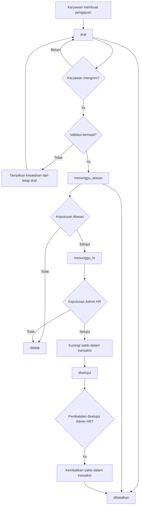

# Alur Bisnis

Dokumen ini menjelaskan rancangan alur bisnis pengajuan cuti. Seluruh alur masih berupa rancangan dan perlu divalidasi sebelum diimplementasikan.

## Status Pengajuan

| Status | Arti |
| --- | --- |
| `draf` | Pengajuan masih disusun dan hanya dapat dilihat atau diubah oleh pemiliknya. |
| `menunggu_atasan` | Pengajuan telah dikirim dan menunggu keputusan Atasan. |
| `menunggu_hr` | Pengajuan telah disetujui Atasan dan menunggu keputusan akhir Admin HR. |
| `disetujui` | Pengajuan telah disetujui Admin HR dan saldo telah dikurangi. |
| `ditolak` | Pengajuan ditolak oleh Atasan atau Admin HR. Status ini bersifat akhir. |
| `dibatalkan` | Pengajuan dibatalkan sesuai kewenangan dan aturan saldo. Status ini bersifat akhir. |

## Gambaran Alur Utama

## Pengajuan Cuti

1. Karyawan membuat pengajuan baru dan memilih jenis cuti.
2. Karyawan memilih satu atau beberapa tanggal dan mengisi alasan.
3. Sistem menyimpan pengajuan sebagai `draf`.
4. Karyawan dapat memperbaiki draf sebelum mengirimnya.
5. Saat dikirim, sistem menjalankan seluruh validasi kembali.
6. Jika valid, status berubah menjadi `menunggu_atasan` dan waktu pengiriman dicatat.
7. Jika tidak valid, status tetap `draf` dan sistem menampilkan alasan kegagalan.

## Validasi Pengajuan

Validasi dijalankan di sisi server ketika draf dikirim dan diperiksa kembali sebelum keputusan akhir untuk mencegah data yang sudah berubah.

- Pengguna aktif dan terhubung dengan data pegawai.
- Jenis cuti aktif dan dapat digunakan.
- Sedikitnya satu tanggal dipilih.
- Setiap tanggal berada dalam rentang yang diizinkan kebijakan.
- Tanggal bukan hari libur aktif atau akhir pekan.
- Tidak ada tanggal yang berulang dalam pengajuan yang sama.
- Tidak ada tanggal yang tumpang tindih dengan pengajuan aktif milik pegawai tersebut.
- Jumlah hari kerja sesuai jumlah rincian tanggal yang valid.
- Saldo tahun dan jenis cuti tersedia serta mencukupi.
- Pegawai memiliki Atasan yang aktif dan bukan dirinya sendiri.

Pengajuan aktif untuk pemeriksaan tumpang tindih adalah pengajuan berstatus `menunggu_atasan`, `menunggu_hr`, atau `disetujui`. Pengajuan `ditolak` dan `dibatalkan` tidak memblokir tanggal baru. Ketentuan ini merupakan **asumsi awal**.

## Persetujuan Atasan

1. Atasan melihat pengajuan `menunggu_atasan` dari bawahan langsungnya.
2. Sistem memastikan Atasan bukan pegawai pemilik pengajuan.
3. Atasan memeriksa jenis cuti, tanggal, alasan, dan saldo yang relevan.
4. Jika disetujui, sistem mencatat keputusan dan mengubah status menjadi `menunggu_hr`.
5. Jika ditolak, Atasan wajib memberikan alasan dan status berubah menjadi `ditolak`.
6. Keputusan hanya boleh dicatat satu kali pada tahap Atasan.

## Persetujuan Admin HR

1. Admin HR hanya memproses pengajuan berstatus `menunggu_hr`.
2. Sistem memeriksa ulang tanggal aktif dan saldo di dalam transaksi database.
3. Jika disetujui, sistem mengunci data saldo yang berkaitan, memastikan saldo mencukupi, mengurangi saldo tepat satu kali, mencatat keputusan, lalu mengubah status menjadi `disetujui`.
4. Jika ditolak, Admin HR wajib memberikan alasan, mencatat keputusan, dan mengubah status menjadi `ditolak` tanpa mengubah saldo.
5. Apabila validasi ulang gagal, keputusan tidak disimpan dan Admin HR menerima penjelasan untuk meninjau data.

## Penolakan

- Penolakan hanya dapat dilakukan oleh aktor yang sedang berwenang pada tahap tersebut.
- Alasan penolakan wajib diisi agar dapat dipahami Karyawan.
- Penolakan menghasilkan status akhir `ditolak`.
- Pengajuan yang ditolak tidak dapat dikirim ulang; Karyawan membuat pengajuan baru jika diperlukan.
- Penolakan tidak mengurangi atau mengubah saldo cuti.

## Pembatalan

Rancangan awal pembatalan adalah sebagai berikut:

- Karyawan dapat membatalkan pengajuan `draf` atau `menunggu_atasan` miliknya.
- Pengajuan `menunggu_hr` tidak dapat dibatalkan langsung oleh Karyawan karena sudah memiliki keputusan Atasan. Pembatalan perlu diproses Admin HR.
- Pengajuan `disetujui` hanya dapat diubah menjadi `dibatalkan` oleh Admin HR setelah alasan pembatalan diverifikasi.
- Pembatalan pengajuan `disetujui` mengembalikan saldo dengan jumlah yang sebelumnya dikurangi, tepat satu kali, dalam transaksi database.
- Pengajuan `ditolak` atau `dibatalkan` tidak dapat dibatalkan kembali.
- Aktor, alasan, dan waktu pembatalan harus dicatat dalam jejak keputusan.

Aturan pembatalan setelah persetujuan merupakan **asumsi awal** dan harus dikonfirmasi dengan kebijakan PT Medika Antapani.

## Perubahan Saldo

- Pembuatan draf dan persetujuan Atasan tidak mengurangi saldo.
- Saldo dikurangi setelah Admin HR memberi persetujuan akhir.
- Saldo diperiksa dan dikunci sebelum pengurangan untuk mencegah penggunaan bersamaan.
- Nilai saldo tidak boleh menjadi negatif.
- Proses persetujuan akhir harus idempoten: permintaan berulang tidak boleh mengurangi saldo lebih dari sekali.
- Penolakan tidak mengubah saldo.
- Pembatalan pengajuan yang telah disetujui mengembalikan saldo tepat satu kali.
- Setiap perubahan saldo harus dapat ditelusuri ke pengajuan terkait melalui catatan pengajuan dan persetujuan.

## Transisi Status dan Wewenang

| Dari | Ke | Aktor | Kondisi |
| --- | --- | --- | --- |
| - | `draf` | Karyawan | Pengajuan baru dibuat untuk diri sendiri. |
| `draf` | `menunggu_atasan` | Karyawan | Seluruh validasi berhasil saat pengajuan dikirim. |
| `draf` | `dibatalkan` | Karyawan | Pemilik membatalkan draf. |
| `menunggu_atasan` | `menunggu_hr` | Atasan | Atasan adalah Atasan aktif pemilik, bukan pemilik pengajuan, dan menyetujui. |
| `menunggu_atasan` | `ditolak` | Atasan | Atasan berwenang menolak dan mengisi alasan. |
| `menunggu_atasan` | `dibatalkan` | Karyawan | Pemilik membatalkan sebelum ada keputusan Atasan. |
| `menunggu_hr` | `disetujui` | Admin HR | Validasi ulang berhasil dan saldo dikurangi dalam transaksi. |
| `menunggu_hr` | `ditolak` | Admin HR | Admin HR menolak dan mengisi alasan; saldo tidak berubah. |
| `menunggu_hr` | `dibatalkan` | Admin HR | Permintaan pembatalan diverifikasi sebelum keputusan akhir. |
| `disetujui` | `dibatalkan` | Admin HR | Pembatalan disetujui dan saldo dikembalikan tepat satu kali. |

Tidak ada transisi keluar dari `ditolak` atau `dibatalkan`. Atasan tidak boleh menyetujui pengajuannya sendiri dalam keadaan apa pun.

## Pengelolaan Hari Libur

- Admin HR menambah, mengubah, menonaktifkan, atau melihat hari libur.
- Satu tanggal hari libur aktif hanya dicatat satu kali.
- Tanggal hari libur aktif dan akhir pekan tidak dihitung sebagai tanggal cuti.
- Perubahan hari libur yang bertabrakan dengan pengajuan aktif perlu menampilkan peringatan dan ditinjau Admin HR.
- **Asumsi awal:** hari libur tidak mengubah otomatis pengajuan yang sudah `disetujui`; Admin HR harus meninjau dan melakukan penyesuaian terkontrol.

## Pengelolaan Jenis Cuti

- Admin HR mengelola kode, nama, jatah bawaan, aturan pengurangan saldo, dan status aktif.
- Jenis cuti yang telah dipakai tidak dihapus secara permanen, tetapi dinonaktifkan agar riwayat tetap utuh.
- Perubahan jatah bawaan tidak mengubah saldo pegawai yang sudah diterbitkan tanpa tindakan penyesuaian terpisah.
- Jenis cuti tidak aktif tidak dapat dipilih pada pengajuan baru.

## Rekap Pengajuan

- Admin HR dapat menyaring rekap berdasarkan periode, pegawai, departemen, jenis cuti, dan status.
- Atasan hanya dapat melihat rekap yang terbatas pada bawahannya sesuai kewenangan.
- Karyawan hanya dapat melihat riwayat miliknya.
- Ekspor rekap harus mengikuti filter dan hak akses yang sama dengan data di layar.
- Rekap menampilkan data yang diperlukan saja dan tidak boleh membuka kata sandi atau data rahasia.
