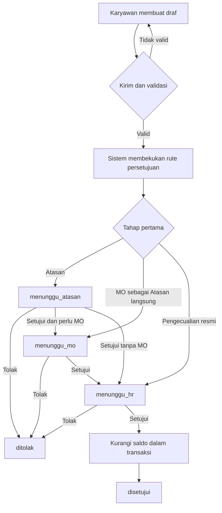

# Alur Bisnis

Dokumen ini menjelaskan rancangan alur bisnis pengajuan cuti. Seluruh alur bisnis masih direncanakan dan belum diimplementasikan. Struktur organisasi mengacu pada [Rancangan Organisasi dan Persetujuan Berjenjang](12-rancangan-organisasi-dan-persetujuan.md).

## Status Pengajuan

| Status | Arti |
| --- | --- |
| `draf` | Pengajuan masih disusun oleh pemilik. |
| `menunggu_atasan` | Menunggu keputusan Atasan langsung. |
| `menunggu_mo` | Keputusan Atasan langsung selesai dan pengajuan menunggu MO. |
| `menunggu_hr` | Seluruh tahap organisasi selesai dan menunggu keputusan akhir Admin HR. |
| `disetujui` | Disetujui Admin HR dan saldo telah dikurangi. |
| `ditolak` | Ditolak pada salah satu tahap. |
| `dibatalkan` | Dibatalkan sesuai kewenangan dan aturan saldo. |

## Gambaran Alur Utama

## Pengajuan dan Validasi

1. Karyawan membuat pengajuan, memilih jenis dan tanggal cuti, lalu mengisi alasan.
2. Sistem menyimpannya sebagai `draf`.
3. Saat dikirim, sistem memvalidasi akun, pegawai, tanggal, hari libur, tumpang tindih, dan saldo.
4. Sistem mengambil penugasan utama aktif dan membentuk rute berdasarkan unit bisnis.
5. Sistem memastikan seluruh penyetuju aktif, bukan pemohon, dan tidak berulang pada tahap lain.
6. Rute disimpan sebagai snapshot agar mutasi jabatan tidak mengubah pengajuan aktif.
7. Status berubah mengikuti tahap pertama; jika data tidak lengkap, pengiriman ditolak dan tetap `draf`.

Pengajuan aktif untuk pemeriksaan tumpang tindih adalah `menunggu_atasan`, `menunggu_mo`, `menunggu_hr`, dan `disetujui`.

## Rute Berdasarkan Unit

| Kondisi | Rute persetujuan |
| --- | --- |
| Head Office | Atasan langsung -> Admin HR |
| Unit operasional, Atasan bukan MO | Atasan langsung -> MO -> Admin HR |
| Unit operasional, Atasan langsung adalah MO | MO -> Admin HR |
| Jabatan dengan pengecualian resmi | Admin HR |

Jabatan tanpa Atasan tidak otomatis langsung menuju HR. Pengecualian harus dikonfigurasi secara resmi. Jika terdapat lebih dari satu MO, sistem memakai MO yang cakupannya ditetapkan untuk jabatan atau bagian pemohon, bukan memilih secara acak.

## Keputusan Atasan dan MO

1. Penyetuju hanya melihat antrean yang ditujukan kepadanya berdasarkan snapshot rute.
2. Sistem memastikan penyetuju bukan pemohon dan belum memutus tahap lain.
3. Persetujuan memajukan pengajuan ke tahap berikutnya.
4. Penolakan mewajibkan alasan dan mengubah status menjadi `ditolak`.
5. Setiap tahap hanya dapat diputus satu kali.

MO menggunakan fungsi Atasan pada aplikasi. MO bukan aktor login keempat, melainkan kategori jabatan dan tahap khusus unit operasional.

## Keputusan Admin HR

1. Admin HR hanya memproses `menunggu_hr` setelah seluruh tahap sebelumnya selesai.
2. Admin HR yang merupakan pemohon atau telah memutus tahap sebelumnya tidak dapat memberi keputusan akhir.
3. Persetujuan akhir memeriksa dan mengunci saldo dalam transaksi, mengurangi saldo tepat satu kali, mencatat keputusan, lalu mengubah status menjadi `disetujui`.
4. Penolakan mewajibkan alasan dan tidak mengubah saldo.

## Penolakan, Pembatalan, dan Saldo

- Penolakan hanya dilakukan penyetuju tahap aktif dan wajib memiliki alasan.
- Karyawan dapat membatalkan draf atau pengajuan sebelum keputusan pertama.
- Setelah keputusan pertama, pembatalan diproses Admin HR.
- Pengajuan `disetujui` hanya dapat dibatalkan Admin HR sebelum tanggal cuti pertama.
- Saldo hanya berkurang setelah persetujuan akhir dan tidak boleh negatif.
- Penolakan tidak mengubah saldo; pembatalan sah mengembalikan saldo tepat satu kali.
- Seluruh keputusan dan pembatalan menyimpan aktor, alasan atau catatan, dan waktu.

## Transisi Status dan Wewenang

| Dari | Ke | Aktor | Kondisi |
| --- | --- | --- | --- |
| - | `draf` | Karyawan | Pengajuan dibuat. |
| `draf` | status tahap pertama | Karyawan dan sistem | Validasi berhasil dan rute dibekukan. |
| `draf` | `dibatalkan` | Karyawan | Pemilik membatalkan draf. |
| `menunggu_atasan` | `menunggu_mo` | Atasan | Disetujui dan masih ada tahap MO. |
| `menunggu_atasan` | `menunggu_hr` | Atasan | Disetujui dan tahap berikutnya HR. |
| `menunggu_mo` | `menunggu_hr` | MO | MO yang ditetapkan menyetujui. |
| status menunggu | `ditolak` | Penyetuju tahap aktif | Ditolak dengan alasan. |
| status sebelum keputusan pertama | `dibatalkan` | Karyawan | Belum ada keputusan pada rute. |
| `menunggu_hr` | `disetujui` | Admin HR | Validasi dan pengurangan saldo berhasil. |
| `menunggu_hr` | `dibatalkan` | Admin HR | Pembatalan diverifikasi sebelum keputusan akhir. |
| `disetujui` | `dibatalkan` | Admin HR | Sebelum tanggal pertama dan saldo dikembalikan. |

Tidak ada transisi keluar dari `ditolak` atau `dibatalkan`.

## Data Utama dan Rekap

- Admin HR mengelola unit bisnis, departemen atau bagian, jabatan, penugasan, peran, jenis cuti, saldo, dan hari libur.
- Data yang telah dipakai dalam riwayat dinonaktifkan, bukan dihapus permanen.
- Rekap dapat disaring berdasarkan periode, unit, departemen, pegawai, jenis, dan status.
- Atasan hanya melihat cakupannya; Karyawan hanya melihat miliknya; ekspor mengikuti batas akses yang sama.
