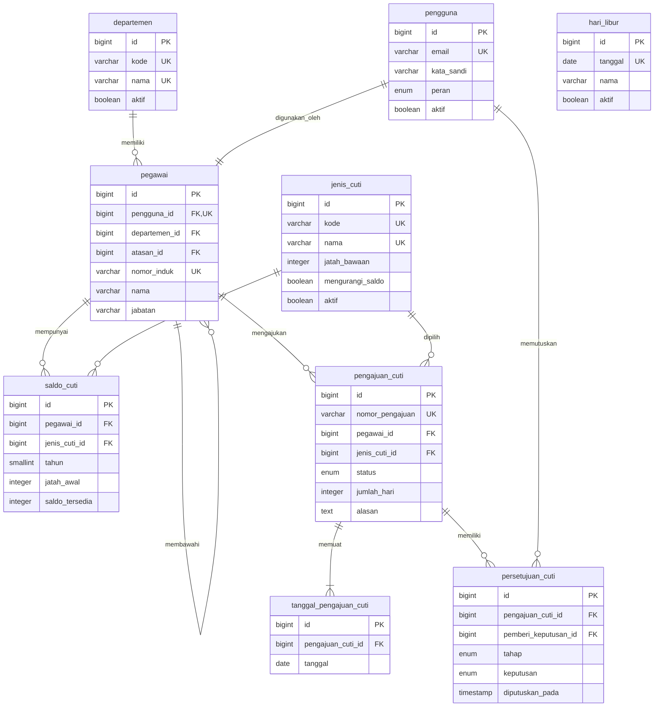

# Rancangan Database

Dokumen ini berisi rancangan konseptual database. Belum ada migration bisnis yang dibuat. Nama, tipe, indeks, dan aturan berikut perlu ditinjau kembali sebelum implementasi.

## Prinsip Rancangan

- Nama tabel dan kolom bisnis menggunakan bahasa Indonesia.
- Setiap pengguna terhubung dengan tepat satu pegawai.
- Pegawai dapat memiliki satu Atasan yang juga tercatat sebagai pegawai.
- Saldo dicatat per pegawai, jenis cuti, dan tahun.
- Satu pengajuan dapat memiliki beberapa tanggal dan beberapa catatan persetujuan.
- Keputusan dan perubahan saldo akhir dilakukan dalam transaksi database.
- Data yang sudah menjadi bagian riwayat dinonaktifkan, bukan dihapus sembarangan.
- Tabel teknis Laravel seperti `migrations`, `cache`, `cache_locks`, `jobs`, dan `job_batches` boleh tetap menggunakan nama bawaan framework.

## Tambahan Tabel `departemen`

Tabel `departemen` ditambahkan agar hubungan organisasi tidak disimpan sebagai teks berulang pada setiap pegawai. Tabel ini membantu penyaringan rekap dan pengelompokan pegawai tanpa membuat rancangan terlalu rumit.

## ERD Konseptual

`hari_libur` tidak memiliki relasi langsung ke pengajuan. Tanggalnya digunakan oleh layanan validasi ketika pengajuan dikirim dan ditinjau.

## Konvensi Kamus Data

- **PK** menunjukkan primary key.
- **FK** menunjukkan foreign key.
- **UK** menunjukkan unique key, termasuk unique gabungan yang disebutkan pada aturan tabel.
- `timestamp` konseptual disimpan dalam zona waktu aplikasi dan ditampilkan sesuai zona waktu yang disepakati.
- Kolom `dibuat_pada` dan `diperbarui_pada` adalah padanan konseptual timestamp pencatatan. Nama teknis akhir dapat diselaraskan dengan kebutuhan Laravel sebelum migration dibuat.

## Tabel `departemen`

**Tujuan:** menyimpan unit organisasi untuk pengelompokan pegawai dan rekap.

| Kolom | Tipe konseptual | Boleh kosong | PK | FK | Nilai bawaan | Unik | Penjelasan |
| --- | --- | --- | --- | --- | --- | --- | --- |
| `id` | bigint unsigned | Tidak | Ya | - | otomatis | Ya | Identitas departemen. |
| `kode` | varchar(20) | Tidak | Tidak | - | - | Ya | Kode singkat departemen. |
| `nama` | varchar(100) | Tidak | Tidak | - | - | Ya | Nama departemen. |
| `aktif` | boolean | Tidak | Tidak | - | true | Tidak | Menentukan apakah departemen dapat dipilih. |
| `dibuat_pada` | timestamp | Tidak | Tidak | - | waktu saat ini | Tidak | Waktu pembuatan data. |
| `diperbarui_pada` | timestamp | Tidak | Tidak | - | waktu saat ini | Tidak | Waktu perubahan terakhir. |

## Tabel `pengguna`

**Tujuan:** menyimpan akun autentikasi dan peran akses.

| Kolom | Tipe konseptual | Boleh kosong | PK | FK | Nilai bawaan | Unik | Penjelasan |
| --- | --- | --- | --- | --- | --- | --- | --- |
| `id` | bigint unsigned | Tidak | Ya | - | otomatis | Ya | Identitas akun. |
| `email` | varchar(255) | Tidak | Tidak | - | - | Ya | Alamat email untuk masuk. |
| `kata_sandi` | varchar(255) | Tidak | Tidak | - | - | Tidak | Hash kata sandi, bukan kata sandi asli. |
| `peran` | enum | Tidak | Tidak | - | `karyawan` | Tidak | Nilai awal: `karyawan`, `atasan`, atau `admin_hr`. |
| `aktif` | boolean | Tidak | Tidak | - | true | Tidak | Menentukan apakah akun dapat digunakan. |
| `token_ingat` | varchar(100) | Ya | Tidak | - | null | Tidak | Token teknis untuk fitur ingat saya jika digunakan. |
| `terakhir_masuk_pada` | timestamp | Ya | Tidak | - | null | Tidak | Waktu masuk terakhir yang berhasil. |
| `dibuat_pada` | timestamp | Tidak | Tidak | - | waktu saat ini | Tidak | Waktu pembuatan akun. |
| `diperbarui_pada` | timestamp | Tidak | Tidak | - | waktu saat ini | Tidak | Waktu perubahan terakhir. |

**Aturan:** email dibandingkan secara tidak peka huruf besar-kecil. Satu akun wajib terhubung dengan tepat satu baris `pegawai` melalui aturan unik `pegawai.pengguna_id`.

## Tabel `pegawai`

**Tujuan:** menyimpan identitas pegawai dan struktur pelaporan.

| Kolom | Tipe konseptual | Boleh kosong | PK | FK | Nilai bawaan | Unik | Penjelasan |
| --- | --- | --- | --- | --- | --- | --- | --- |
| `id` | bigint unsigned | Tidak | Ya | - | otomatis | Ya | Identitas pegawai. |
| `pengguna_id` | bigint unsigned | Tidak | Tidak | `pengguna.id` | - | Ya | Akun yang dimiliki pegawai. |
| `departemen_id` | bigint unsigned | Tidak | Tidak | `departemen.id` | - | Tidak | Departemen pegawai. |
| `atasan_id` | bigint unsigned | Ya | Tidak | `pegawai.id` | null | Tidak | Atasan langsung; null untuk pimpinan tertinggi atau kondisi awal. |
| `nomor_induk` | varchar(30) | Tidak | Tidak | - | - | Ya | Nomor identitas internal pegawai. |
| `nama` | varchar(150) | Tidak | Tidak | - | - | Tidak | Nama lengkap pegawai. |
| `jabatan` | varchar(100) | Tidak | Tidak | - | - | Tidak | Jabatan pegawai. |
| `tanggal_masuk` | date | Ya | Tidak | - | null | Tidak | Tanggal mulai bekerja jika tersedia. |
| `aktif` | boolean | Tidak | Tidak | - | true | Tidak | Status aktif pegawai. |
| `dibuat_pada` | timestamp | Tidak | Tidak | - | waktu saat ini | Tidak | Waktu pembuatan data. |
| `diperbarui_pada` | timestamp | Tidak | Tidak | - | waktu saat ini | Tidak | Waktu perubahan terakhir. |

**Aturan:** `atasan_id` tidak boleh sama dengan `id`. Validasi juga harus mencegah rantai Atasan melingkar. Penghapusan pegawai yang telah memiliki riwayat pengajuan tidak diperbolehkan; gunakan `aktif = false`.

## Tabel `jenis_cuti`

**Tujuan:** menyimpan kategori cuti dan aturan dasarnya.

| Kolom | Tipe konseptual | Boleh kosong | PK | FK | Nilai bawaan | Unik | Penjelasan |
| --- | --- | --- | --- | --- | --- | --- | --- |
| `id` | bigint unsigned | Tidak | Ya | - | otomatis | Ya | Identitas jenis cuti. |
| `kode` | varchar(20) | Tidak | Tidak | - | - | Ya | Kode singkat jenis cuti. |
| `nama` | varchar(100) | Tidak | Tidak | - | - | Ya | Nama jenis cuti. |
| `deskripsi` | text | Ya | Tidak | - | null | Tidak | Penjelasan singkat jenis cuti. |
| `jatah_bawaan` | integer unsigned | Tidak | Tidak | - | 0 | Tidak | Jatah awal yang dapat digunakan saat penerbitan saldo. |
| `mengurangi_saldo` | boolean | Tidak | Tidak | - | true | Tidak | Menentukan apakah persetujuan mengurangi saldo. |
| `aktif` | boolean | Tidak | Tidak | - | true | Tidak | Menentukan apakah jenis dapat dipilih pada pengajuan baru. |
| `dibuat_pada` | timestamp | Tidak | Tidak | - | waktu saat ini | Tidak | Waktu pembuatan data. |
| `diperbarui_pada` | timestamp | Tidak | Tidak | - | waktu saat ini | Tidak | Waktu perubahan terakhir. |

**Aturan:** jenis cuti yang sudah digunakan dinonaktifkan, bukan dihapus. Nilai `jatah_bawaan` tidak boleh negatif.

## Tabel `saldo_cuti`

**Tujuan:** menyimpan jatah dan saldo tersedia setiap pegawai per jenis cuti dan tahun.

| Kolom | Tipe konseptual | Boleh kosong | PK | FK | Nilai bawaan | Unik | Penjelasan |
| --- | --- | --- | --- | --- | --- | --- | --- |
| `id` | bigint unsigned | Tidak | Ya | - | otomatis | Ya | Identitas saldo. |
| `pegawai_id` | bigint unsigned | Tidak | Tidak | `pegawai.id` | - | Gabungan | Pemilik saldo. |
| `jenis_cuti_id` | bigint unsigned | Tidak | Tidak | `jenis_cuti.id` | - | Gabungan | Jenis cuti saldo. |
| `tahun` | smallint unsigned | Tidak | Tidak | - | - | Gabungan | Tahun berlakunya saldo. |
| `jatah_awal` | integer unsigned | Tidak | Tidak | - | 0 | Tidak | Jatah yang diberikan pada awal periode. |
| `saldo_tersedia` | integer unsigned | Tidak | Tidak | - | 0 | Tidak | Saldo yang masih dapat digunakan. |
| `catatan` | varchar(255) | Ya | Tidak | - | null | Tidak | Catatan penyesuaian terakhir jika diperlukan. |
| `dibuat_pada` | timestamp | Tidak | Tidak | - | waktu saat ini | Tidak | Waktu pembuatan saldo. |
| `diperbarui_pada` | timestamp | Tidak | Tidak | - | waktu saat ini | Tidak | Waktu perubahan saldo terakhir. |

**Aturan unik:** kombinasi (`pegawai_id`, `jenis_cuti_id`, `tahun`).

**Aturan saldo:** `jatah_awal` dan `saldo_tersedia` tidak boleh negatif. Pengurangan atau pengembalian saldo harus mengunci baris saldo di dalam transaksi, memeriksa status pengajuan, dan bersifat idempoten agar permintaan berulang tidak mengubah saldo dua kali.

## Tabel `pengajuan_cuti`

**Tujuan:** menyimpan data utama dan status terkini pengajuan.

| Kolom | Tipe konseptual | Boleh kosong | PK | FK | Nilai bawaan | Unik | Penjelasan |
| --- | --- | --- | --- | --- | --- | --- | --- |
| `id` | bigint unsigned | Tidak | Ya | - | otomatis | Ya | Identitas pengajuan. |
| `nomor_pengajuan` | varchar(40) | Tidak | Tidak | - | dibuat sistem | Ya | Nomor yang mudah dirujuk pengguna. |
| `pegawai_id` | bigint unsigned | Tidak | Tidak | `pegawai.id` | - | Tidak | Pegawai yang mengajukan. |
| `jenis_cuti_id` | bigint unsigned | Tidak | Tidak | `jenis_cuti.id` | - | Tidak | Jenis cuti yang diajukan. |
| `status` | enum | Tidak | Tidak | - | `draf` | Tidak | `draf`, `menunggu_atasan`, `menunggu_hr`, `disetujui`, `ditolak`, atau `dibatalkan`. |
| `alasan` | text | Tidak | Tidak | - | - | Tidak | Alasan pengajuan dari Karyawan. |
| `jumlah_hari` | integer unsigned | Tidak | Tidak | - | 0 | Tidak | Jumlah tanggal kerja valid dalam pengajuan. |
| `diajukan_pada` | timestamp | Ya | Tidak | - | null | Tidak | Waktu draf dikirim kepada Atasan. |
| `dibatalkan_pada` | timestamp | Ya | Tidak | - | null | Tidak | Waktu pengajuan dibatalkan. |
| `dibuat_pada` | timestamp | Tidak | Tidak | - | waktu saat ini | Tidak | Waktu pembuatan draf. |
| `diperbarui_pada` | timestamp | Tidak | Tidak | - | waktu saat ini | Tidak | Waktu perubahan terakhir. |

**Aturan:** `jumlah_hari` harus sama dengan jumlah rincian tanggal yang sah dan lebih dari nol sebelum pengajuan dikirim. Perubahan status hanya mengikuti tabel transisi pada dokumen alur bisnis.

## Tabel `tanggal_pengajuan_cuti`

**Tujuan:** menyimpan setiap tanggal cuti dalam satu pengajuan.

| Kolom | Tipe konseptual | Boleh kosong | PK | FK | Nilai bawaan | Unik | Penjelasan |
| --- | --- | --- | --- | --- | --- | --- | --- |
| `id` | bigint unsigned | Tidak | Ya | - | otomatis | Ya | Identitas rincian tanggal. |
| `pengajuan_cuti_id` | bigint unsigned | Tidak | Tidak | `pengajuan_cuti.id` | - | Gabungan | Pengajuan induk. |
| `tanggal` | date | Tidak | Tidak | - | - | Gabungan | Tanggal cuti yang diminta. |
| `dibuat_pada` | timestamp | Tidak | Tidak | - | waktu saat ini | Tidak | Waktu rincian dibuat. |

**Aturan unik:** kombinasi (`pengajuan_cuti_id`, `tanggal`) mencegah tanggal berulang dalam pengajuan yang sama.

**Aturan tumpang tindih:** karena pegawai berada pada tabel induk dan status dapat berubah, tumpang tindih antar-pengajuan tidak cukup dicegah oleh unique key sederhana. Saat pengajuan dikirim dan disetujui akhir, sistem harus membuka transaksi, mengunci baris saldo pegawai yang relevan, lalu mencari tanggal yang sama pada pengajuan aktif (`menunggu_atasan`, `menunggu_hr`, atau `disetujui`). Indeks pada `tanggal` dan indeks status serta pegawai pada tabel induk diperlukan agar pemeriksaan efisien.

## Tabel `persetujuan_cuti`

**Tujuan:** menyimpan jejak keputusan setiap tahap, termasuk pembatalan yang diproses Admin HR.

| Kolom | Tipe konseptual | Boleh kosong | PK | FK | Nilai bawaan | Unik | Penjelasan |
| --- | --- | --- | --- | --- | --- | --- | --- |
| `id` | bigint unsigned | Tidak | Ya | - | otomatis | Ya | Identitas catatan keputusan. |
| `pengajuan_cuti_id` | bigint unsigned | Tidak | Tidak | `pengajuan_cuti.id` | - | Gabungan | Pengajuan yang diproses. |
| `pemberi_keputusan_id` | bigint unsigned | Tidak | Tidak | `pengguna.id` | - | Tidak | Pengguna yang melakukan tindakan. |
| `tahap` | enum | Tidak | Tidak | - | - | Gabungan | `atasan`, `admin_hr`, atau `pembatalan`. |
| `keputusan` | enum | Tidak | Tidak | - | - | Tidak | `disetujui`, `ditolak`, atau `dibatalkan` sesuai tahap. |
| `catatan` | text | Ya | Tidak | - | null | Tidak | Catatan keputusan; wajib untuk penolakan dan pembatalan. |
| `diputuskan_pada` | timestamp | Tidak | Tidak | - | waktu saat ini | Tidak | Waktu keputusan diberikan. |
| `dibuat_pada` | timestamp | Tidak | Tidak | - | waktu saat ini | Tidak | Waktu catatan disimpan. |

**Aturan unik awal:** kombinasi (`pengajuan_cuti_id`, `tahap`) agar satu tahap tidak diproses dua kali. Jika kelak dibutuhkan beberapa peristiwa pembatalan atau proses ulang, rancangan ini harus ditinjau sebelum migration dibuat.

**Aturan:** pemberi keputusan tidak boleh diambil dari input browser. Sistem mengisinya dari pengguna yang sedang masuk. Untuk tahap Atasan, pemberi keputusan tidak boleh merupakan pemilik pengajuan.

## Tabel `hari_libur`

**Tujuan:** menyimpan hari libur yang dikecualikan dari perhitungan hari cuti.

| Kolom | Tipe konseptual | Boleh kosong | PK | FK | Nilai bawaan | Unik | Penjelasan |
| --- | --- | --- | --- | --- | --- | --- | --- |
| `id` | bigint unsigned | Tidak | Ya | - | otomatis | Ya | Identitas hari libur. |
| `tanggal` | date | Tidak | Tidak | - | - | Ya | Tanggal libur. |
| `nama` | varchar(150) | Tidak | Tidak | - | - | Tidak | Nama atau keterangan hari libur. |
| `jenis` | enum | Tidak | Tidak | - | `nasional` | Tidak | Rancangan nilai: `nasional` atau `perusahaan`. |
| `aktif` | boolean | Tidak | Tidak | - | true | Tidak | Menentukan apakah tanggal dipakai dalam validasi. |
| `dibuat_pada` | timestamp | Tidak | Tidak | - | waktu saat ini | Tidak | Waktu pembuatan data. |
| `diperbarui_pada` | timestamp | Tidak | Tidak | - | waktu saat ini | Tidak | Waktu perubahan terakhir. |

**Aturan:** satu tanggal hanya boleh memiliki satu catatan aktif pada rancangan awal. Jika diperlukan beberapa keterangan untuk tanggal yang sama, struktur perlu disesuaikan sebelum implementasi.

## Aturan Integritas dan Transaksi

### Pengiriman Pengajuan

1. Validasi kepemilikan, status, jenis cuti, Atasan, hari libur, akhir pekan, dan rincian tanggal.
2. Mulai transaksi dan kunci saldo terkait untuk menyusun urutan pemeriksaan pengajuan pegawai.
3. Periksa kembali saldo dan tanggal yang tumpang tindih.
4. Simpan rincian dan ubah status menjadi `menunggu_atasan`.
5. Batalkan seluruh perubahan jika salah satu langkah gagal.

### Persetujuan Akhir

1. Pastikan status `menunggu_hr` dan belum ada keputusan tahap Admin HR.
2. Mulai transaksi dan kunci pengajuan serta saldo terkait.
3. Periksa ulang tanggal, hari libur, tumpang tindih, dan saldo.
4. Kurangi `saldo_tersedia` jika jenis cuti memang mengurangi saldo.
5. Simpan `persetujuan_cuti` dan ubah status menjadi `disetujui`.
6. Commit hanya jika seluruh langkah berhasil.

### Pembatalan Setelah Disetujui

1. Hanya Admin HR yang memproses berdasarkan alasan yang telah diverifikasi.
2. Kunci pengajuan dan saldo dalam satu transaksi.
3. Pastikan belum ada catatan tahap `pembatalan`.
4. Kembalikan saldo sebesar `jumlah_hari` jika sebelumnya dikurangi.
5. Simpan jejak pembatalan dan ubah status menjadi `dibatalkan`.

## Indeks Awal yang Disarankan

- `pengguna.email` unik.
- `pegawai.pengguna_id` unik dan `pegawai.nomor_induk` unik.
- Indeks pada `pegawai.atasan_id` dan `pegawai.departemen_id`.
- Kombinasi unik saldo (`pegawai_id`, `jenis_cuti_id`, `tahun`).
- `pengajuan_cuti.nomor_pengajuan` unik.
- Indeks gabungan `pengajuan_cuti` pada (`pegawai_id`, `status`) dan (`status`, `dibuat_pada`).
- Kombinasi unik tanggal (`pengajuan_cuti_id`, `tanggal`) serta indeks pada `tanggal`.
- Kombinasi unik persetujuan (`pengajuan_cuti_id`, `tahap`).
- `hari_libur.tanggal` unik.

## Keputusan yang Masih Perlu Dikonfirmasi

- Apakah Sabtu dan Minggu selalu menjadi akhir pekan bagi seluruh pegawai.
- Apakah terdapat jenis cuti yang tidak mengurangi saldo.
- Apakah saldo dapat dibawa ke tahun berikutnya.
- Apakah Admin HR boleh mengajukan cuti melalui akun yang sama.
- Apakah satu pegawai dapat memiliki lebih dari satu Atasan atau pemberi persetujuan pengganti.
- Batas waktu pembatalan setelah pengajuan disetujui.
- Format nomor pengajuan dan periode reset nomor.
- Apakah data perlu menggunakan penghapusan lunak selain status `aktif`.
