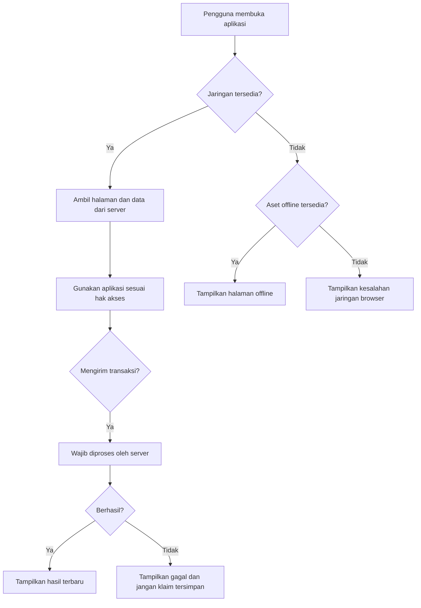

# Rancangan Progressive Web App

Dokumen ini menjelaskan rancangan PWA untuk aplikasi cuti. Komponen yang dibahas belum diimplementasikan pada kondisi proyek saat dokumentasi ini dibuat.

## Alasan Penggunaan PWA

- Memberikan tampilan yang nyaman pada ponsel, tablet, dan desktop.
- Memungkinkan aplikasi dipasang dari browser yang mendukung tanpa distribusi melalui toko aplikasi.
- Menyediakan ikon dan pengalaman peluncuran yang lebih menyerupai aplikasi perangkat.
- Menjaga aset antarmuka dasar tetap tersedia ketika koneksi terputus.
- Mendukung satu basis kode web yang lebih sesuai dengan cakupan capstone.

PWA tidak mengubah aplikasi menjadi sistem yang sepenuhnya dapat digunakan tanpa internet. Pengajuan cuti, persetujuan, perubahan saldo, autentikasi, dan pengambilan data terbaru tetap memerlukan koneksi internet.

## Ruang Lingkup Implementasi Wajib

### Web App Manifest

Manifest direncanakan memuat:

- nama lengkap dan nama singkat aplikasi;
- URL awal dan cakupan aplikasi;
- mode tampilan `standalone`;
- warna tema dan warna latar;
- ikon dalam ukuran yang dibutuhkan; dan
- identitas aplikasi yang stabil.

Manifest harus dapat diakses, menggunakan format yang valid, dan dirujuk dari layout utama.

### Ikon Aplikasi

- Menyediakan ikon minimal untuk ukuran 192x192 dan 512x512 piksel.
- Menyediakan ikon maskable jika hasil pengujian perangkat membutuhkannya.
- Ikon menggunakan identitas visual yang telah disetujui tim dan PT Medika Antapani.
- Berkas ikon dioptimalkan agar tidak memperlambat pemuatan.

### Instalasi ke Perangkat

- Browser yang mendukung dapat menawarkan pemasangan aplikasi.
- Aplikasi yang terpasang membuka URL dan cakupan yang benar.
- Instalasi tidak menjadi syarat untuk menggunakan aplikasi melalui browser.
- Petunjuk instalasi dapat ditampilkan secara sederhana tanpa mengganggu pengguna.

### Service Worker

Service worker digunakan untuk menangani cache aset statis dan halaman offline. Service worker tidak boleh membuat respons transaksi palsu atau menyatakan pengajuan berhasil ketika server tidak dapat dijangkau.

Pendaftaran service worker dilakukan hanya pada lingkungan dan protokol yang mendukung. Kesalahan service worker tidak boleh membuat versi web biasa berhenti berfungsi.

### Cache Aset Statis

Aset yang dapat dipertimbangkan untuk precache:

- stylesheet dan JavaScript hasil build;
- ikon aplikasi;
- logo atau aset visual tetap; dan
- halaman offline khusus.

Rancangan strategi cache:

| Jenis sumber daya | Strategi awal | Alasan |
| --- | --- | --- |
| Aset hasil build dengan nama berversi | Cache first | Nama berkas berubah ketika isi berubah. |
| Navigasi halaman terautentikasi | Network only | Data pribadi dan transaksi harus berasal dari server. |
| Permintaan transaksi | Network only | Pengajuan dan keputusan harus diproses server. |
| Halaman offline | Cache first | Harus tersedia ketika jaringan tidak ada. |

Data pribadi dan halaman terautentikasi tidak dimasukkan ke cache offline. Cache wajib dibatasi pada aset statis serta halaman offline khusus dan tetap melalui peninjauan keamanan.

### Halaman Offline

Ketika navigasi gagal karena jaringan, aplikasi menampilkan halaman offline yang:

- menjelaskan bahwa perangkat tidak terhubung;
- tidak mengklaim data terakhir sebagai data terkini;
- menyarankan pengguna memeriksa koneksi dan mencoba kembali; dan
- tidak menyediakan tombol yang seolah-olah dapat mengirim pengajuan atau keputusan secara offline.

### Pembaruan Cache

- Nama cache menggunakan versi yang dapat diubah saat rilis.
- Service worker baru mengambil aset yang diperlukan pada tahap pemasangan.
- Cache versi lama dibersihkan pada tahap aktivasi.
- Perubahan penting dapat menampilkan pemberitahuan untuk memuat ulang aplikasi.
- Pembaruan tidak boleh menghapus data server karena cache hanya menyimpan sumber daya web yang dipilih.

### HTTPS Produksi

- Lingkungan produksi wajib menggunakan HTTPS agar service worker dan data autentikasi terlindungi.
- Cookie sesi menggunakan pengaturan aman yang sesuai lingkungan produksi.
- Pengembangan lokal dapat menggunakan `localhost`, yang didukung browser untuk pengembangan service worker.

### Tampilan Responsif

- Navigasi, formulir, tabel, dialog, dan pesan validasi dapat digunakan pada layar ponsel.
- Target sentuh memiliki ukuran dan jarak yang memadai.
- Tabel besar menggunakan pola responsif, misalnya gulir horizontal atau tampilan kartu.
- Informasi status tidak dibedakan berdasarkan warna saja.
- Alur utama diuji pada ukuran layar yang disepakati tim.

## Batasan Offline

- Pengguna tidak dapat masuk tanpa koneksi server yang valid.
- Pengajuan cuti tidak dapat dikirim secara offline.
- Atasan dan Admin HR tidak dapat menyetujui atau menolak secara offline.
- Saldo tidak diperbarui dan data terbaru tidak dapat dijamin ketika offline.
- Halaman yang pernah dibuka tidak otomatis boleh ditampilkan offline, terutama bila mengandung data pribadi.
- Push notification dan background sync merupakan pengembangan lanjutan, bukan fitur wajib.

## Gambaran Perilaku Koneksi

## Keamanan dan Privasi Cache

- Jangan menyimpan kata sandi, token mentah, atau isi `.env` pada cache.
- Jangan memasukkan respons yang memuat data pegawai ke precache.
- Pastikan logout tidak meninggalkan halaman pribadi yang dapat dibuka sebagai data cache lama.
- Batasi scope service worker pada aplikasi yang dimaksud.
- Lakukan pengujian pergantian akun pada perangkat yang sama.

## Kriteria Penerimaan PWA

| ID | Kriteria yang dapat diuji |
| --- | --- |
| PWA-001 | Manifest dapat dimuat tanpa kesalahan dan berisi nama, ikon, warna, URL awal, serta mode tampilan yang benar. |
| PWA-002 | Aplikasi dapat dipasang pada browser pendukung dan dibuka dalam mode `standalone`. |
| PWA-003 | Ikon aplikasi tampil benar pada perangkat atau emulator yang diuji. |
| PWA-004 | Service worker berhasil terdaftar pada HTTPS produksi atau `localhost`. |
| PWA-005 | Aset statis yang direncanakan tersedia dari cache setelah kunjungan awal. |
| PWA-006 | Saat offline, navigasi yang tidak tersedia menampilkan halaman offline yang jelas. |
| PWA-007 | Pengajuan dan persetujuan saat offline gagal dengan pesan yang benar dan tidak tercatat sebagai berhasil. |
| PWA-008 | Setelah versi aset berubah, cache lama dibersihkan dan versi baru dapat digunakan. |
| PWA-009 | Logout dan pergantian akun tidak menampilkan data pribadi akun sebelumnya dari cache. |
| PWA-010 | Tampilan utama dapat digunakan pada ukuran ponsel, tablet, dan desktop yang disepakati. |
| PWA-011 | Audit PWA browser tidak menunjukkan masalah wajib yang belum dijelaskan atau ditangani. |
| PWA-012 | Aplikasi web tetap dapat digunakan secara online apabila pendaftaran service worker gagal. |

## Pengembangan Lanjutan

- Push notification untuk pengajuan yang perlu diproses atau keputusan baru.
- Background sync setelah rancangan konflik, keamanan, dan umpan balik pengguna tersedia.
- Shortcut aplikasi menuju halaman yang sering dipakai.
- Pembaruan aplikasi yang lebih halus dengan pemberitahuan versi.

Fitur lanjutan hanya boleh ditambahkan setelah fungsi wajib stabil dan telah diuji.
