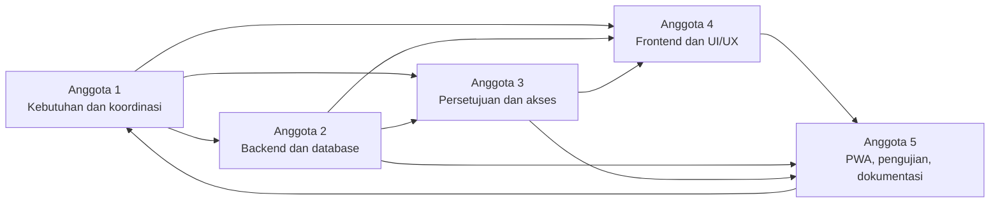

# Pembagian Tugas Tim

Dokumen ini menjadi rancangan awal pembagian tanggung jawab untuk lima anggota. Nama anggota belum ditetapkan dalam dokumentasi, sehingga digunakan sebutan Anggota 1 sampai Anggota 5.

Pembagian fokus tidak berarti anggota hanya memahami bagiannya. Seluruh anggota harus memahami tujuan, aktor, status, alur persetujuan, aturan saldo, dan batasan PWA secara keseluruhan.

## Ringkasan Pembagian

| Anggota | Fokus | Hasil kerja utama yang diharapkan |
| --- | --- | --- |
| Anggota 1 | Analisis sistem dan koordinasi | Kebutuhan yang disepakati, backlog, jadwal, catatan keputusan, dan koordinasi integrasi. |
| Anggota 2 | Backend dan database | Struktur data, factory, logika pengajuan dan saldo, serta pengujian backend terkait. |
| Anggota 3 | Alur persetujuan dan hak akses | Policy, pembatasan akses, keputusan berjenjang, dan pengujian keamanan alur. |
| Anggota 4 | Frontend dan UI/UX | Rancangan layar, komponen Blade, tampilan responsif, dan pengalaman pengguna. |
| Anggota 5 | PWA, pengujian, dan dokumentasi | Manifest, service worker, halaman offline, koordinasi pengujian, dan dokumentasi. |

## Anggota 1 - Analisis Sistem dan Koordinasi

### Tanggung Jawab Utama

- Mengumpulkan dan merapikan kebutuhan sistem.
- Menjaga ruang lingkup agar sesuai capstone.
- Mengelola backlog, prioritas, jadwal, dan pembagian pekerjaan.
- Mencatat usulan serta keputusan proyek dan memastikan riwayatnya terpelihara.
- Memfasilitasi diskusi ketika terjadi perbedaan rancangan.
- Mengawasi kesiapan integrasi dan demonstrasi.

### Hasil Kerja yang Diharapkan

- Kebutuhan fungsional dan nonfungsional yang telah ditinjau tim.
- Diagram dan alur bisnis yang konsisten.
- Backlog dengan kriteria penerimaan yang jelas.
- Catatan rapat atau keputusan penting.
- Daftar risiko, hambatan, dan tindak lanjut.

### Ketergantungan

- Membutuhkan masukan seluruh anggota mengenai kelayakan teknis.
- Memberikan aturan bisnis yang menjadi dasar backend, hak akses, frontend, pengujian, dan PWA.

## Anggota 2 - Backend dan Database

### Tanggung Jawab Utama

- Meninjau dan menerjemahkan rancangan database menjadi implementasi setelah disetujui.
- Mengembangkan model, relasi, factory, migration, dan validasi backend pada tahap implementasi.
- Mengembangkan logika pengajuan, tanggal cuti, hari libur, dan saldo.
- Menjaga transaksi database, idempotensi, dan integritas saldo.
- Menulis pengujian backend untuk perilaku yang menjadi tanggung jawabnya.

### Hasil Kerja yang Diharapkan

- Struktur database yang dapat ditinjau dan dijalankan.
- Data uji yang mendukung skenario utama.
- Layanan atau alur backend pengajuan dan saldo.
- Pengujian validasi, transaksi, dan aturan database.

### Ketergantungan

- Membutuhkan keputusan aturan bisnis dari Anggota 1.
- Berkoordinasi erat dengan Anggota 3 untuk transisi status dan otorisasi.
- Menyediakan kontrak data yang stabil untuk Anggota 4 dan 5.

## Anggota 3 - Alur Persetujuan dan Hak Akses

### Tanggung Jawab Utama

- Mengembangkan pembagian peran dan policy akses.
- Mengembangkan alur keputusan Atasan dan Admin HR.
- Mencegah Atasan menyetujui pengajuan sendiri.
- Memastikan status hanya berpindah melalui transisi yang sah.
- Menjaga jejak pemberi keputusan, alasan, dan waktu.
- Menulis pengujian matriks hak akses dan alur persetujuan.

### Hasil Kerja yang Diharapkan

- Matriks hak akses yang diterapkan dan diuji.
- Policy atau mekanisme otorisasi yang konsisten.
- Alur persetujuan, penolakan, dan pembatalan.
- Pengujian akses silang, peran tidak sah, dan permintaan berulang.

### Ketergantungan

- Membutuhkan struktur pengguna, pegawai, dan pengajuan dari Anggota 2.
- Memberikan kondisi akses dan status yang perlu ditampilkan oleh Anggota 4.
- Menyediakan skenario keamanan penting untuk Anggota 5.

## Anggota 4 - Frontend dan UI/UX

### Tanggung Jawab Utama

- Membuat rancangan layar dan alur interaksi untuk tiga aktor.
- Mengembangkan layout, navigasi, formulir, tabel, kartu status, dan pesan validasi.
- Menjaga konsistensi komponen dan istilah antarmuka.
- Memastikan tampilan responsif dan dapat digunakan pada perangkat sasaran.
- Menampilkan hak akses tanpa menggantikan pemeriksaan server.

### Hasil Kerja yang Diharapkan

- Wireframe atau rancangan layar yang ditinjau tim.
- Komponen Blade yang dapat digunakan kembali.
- Dashboard dan halaman proses untuk setiap aktor.
- Hasil uji responsif serta perbaikan kegunaan.

### Ketergantungan

- Membutuhkan kebutuhan dan prioritas dari Anggota 1.
- Membutuhkan kontrak data dari Anggota 2.
- Membutuhkan aturan tombol dan tindakan dari Anggota 3.
- Berkoordinasi dengan Anggota 5 agar layout mendukung manifest, instalasi, dan halaman offline.

## Anggota 5 - PWA, Pengujian, dan Dokumentasi

### Tanggung Jawab Utama

- Mengembangkan manifest, ikon, service worker, strategi cache, dan halaman offline.
- Menjaga transaksi pengajuan dan persetujuan tetap memerlukan internet.
- Menyusun serta memelihara rencana pengujian lintas fitur.
- Mengkoordinasikan pengujian integrasi, responsif, keamanan dasar, dan PWA.
- Memperbarui README dan dokumentasi rancangan ketika keputusan berubah.

### Hasil Kerja yang Diharapkan

- PWA dasar yang memenuhi kriteria penerimaan.
- Bukti pengujian instalasi, cache, pembaruan, dan mode offline.
- Matriks pengujian dan rekap hasil setelah implementasi.
- Dokumentasi yang konsisten dengan kondisi aplikasi.

### Ketergantungan

- Membutuhkan layout stabil dari Anggota 4 untuk integrasi PWA.
- Membutuhkan alur backend dan hak akses dari Anggota 2 dan 3 untuk menyusun pengujian integrasi.
- Membutuhkan catatan keputusan Anggota 1 agar dokumentasi tetap akurat.

## Ketergantungan Antartugas

Pekerjaan dapat berjalan paralel setelah kontrak dasar disepakati. Perubahan pada database, status, atau hak akses harus segera disampaikan karena dapat memengaruhi seluruh bagian.

## Aturan Review Silang

- Setiap pull request ditinjau sekurang-kurangnya oleh satu anggota yang bukan pembuatnya.
- Perubahan database atau saldo ditinjau oleh Anggota 2 dan sedikitnya satu anggota lain.
- Perubahan policy dan persetujuan ditinjau oleh Anggota 3 dan pemilik area backend terkait.
- Perubahan tampilan utama ditinjau oleh Anggota 4 serta pemilik alur bisnis terkait.
- Perubahan PWA dan skenario pengujian ditinjau oleh Anggota 5 serta pemilik fitur yang diuji.
- Perubahan kebutuhan atau dokumentasi lintas sistem ditinjau oleh Anggota 1.
- Pembuat pull request tetap bertanggung jawab menanggapi masukan dan memperbarui pengujian.
- Review memeriksa fungsi, keamanan, konsistensi istilah, keterbacaan, dan dampak ke area lain.

## Strategi Branch dan Pull Request

1. Perbarui branch utama lokal sebelum mulai mengerjakan tugas.
2. Buat satu branch untuk satu tugas yang memiliki tujuan jelas.
3. Buat commit kecil dan bermakna; jangan memasukkan berkas di luar tugas.
4. Dorong branch ke GitHub dan buat pull request menuju branch utama.
5. Isi deskripsi pull request dengan tujuan, perubahan, cara menguji, bukti bila perlu, dan risiko.
6. Hubungkan pull request dengan tugas atau backlog terkait.
7. Minta review silang dan selesaikan percakapan sebelum merge.
8. Pastikan konflik diselesaikan dan pemeriksaan otomatis berhasil.
9. Hapus branch yang sudah tidak digunakan setelah merge sesuai kesepakatan tim.

### Contoh Nama Branch

- `docs/kebutuhan-sistem`
- `feature/autentikasi-pengguna`
- `feature/pengajuan-cuti`
- `feature/persetujuan-atasan`
- `feature/persetujuan-hr`
- `feature/pwa-dasar`
- `test/validasi-saldo-cuti`
- `fix/cegah-persetujuan-sendiri`

## Definition of Done

Sebuah tugas dianggap selesai apabila:

- kebutuhan dan kriteria penerimaan tugas sudah dipahami;
- implementasi hanya mencakup ruang lingkup yang disepakati;
- kode mengikuti konvensi proyek dan tidak memuat kredensial;
- pengujian yang relevan telah ditulis dan dijalankan;
- hasil pengujian aktual dicatat tanpa klaim yang tidak didukung;
- tampilan terkait telah diperiksa pada ukuran layar yang sesuai;
- dokumentasi diperbarui jika perilaku atau keputusan rancangan berubah;
- pull request telah ditinjau oleh anggota lain;
- seluruh komentar wajib telah diselesaikan; dan
- branch dapat digabungkan tanpa konflik serta pemeriksaan proyek berhasil.

## Pertemuan dan Sinkronisasi

- Lakukan sinkronisasi singkat secara berkala untuk menyampaikan progres dan hambatan.
- Demonstrasikan hasil kecil lebih awal agar kesalahan rancangan cepat ditemukan.
- Catat keputusan yang mengubah status, aturan saldo, database, atau ruang lingkup.
- Gunakan issue atau backlog sebagai sumber status pekerjaan, bukan hanya percakapan pribadi.
- Segera beri tahu tim ketika perubahan berpotensi memblokir anggota lain.
