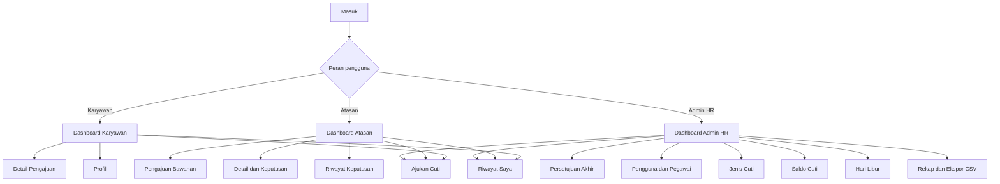

# Rancangan Antarmuka dan Wireframe

Dokumen ini menjadi rancangan awal antarmuka untuk Karyawan, Atasan, dan Admin HR. Wireframe menunjukkan susunan informasi dan alur, bukan desain visual akhir dan bukan bukti bahwa halaman telah diimplementasikan.

## Tujuan Rancangan

- Menyediakan navigasi sederhana sesuai tugas setiap aktor.
- Menampilkan status, saldo, dan tindakan penting secara jelas.
- Mencegah pengguna melihat tindakan yang tidak sesuai tahap pengajuan.
- Menjaga formulir tetap nyaman pada ponsel dan desktop.
- Menjadi acuan sebelum view Blade dan komponen antarmuka dibuat.

## Prinsip Antarmuka

- Gunakan istilah yang sama dengan dokumentasi: Karyawan, Atasan, Admin HR, saldo tersedia, dan enam status resmi.
- Tindakan utama diletakkan paling jelas, tetapi tindakan berbahaya seperti pembatalan atau penolakan memerlukan konfirmasi.
- Status tidak dibedakan berdasarkan warna saja; selalu sertakan teks atau ikon.
- Pesan validasi ditempatkan dekat field dan dirangkum di bagian atas jika perlu.
- Tombol yang tidak berwenang tidak ditampilkan, tetapi keamanan tetap diperiksa server.
- Data pribadi hanya ditampilkan sesuai kepemilikan dan hak akses.
- Ketika koneksi tidak tersedia, tampilkan halaman offline tanpa formulir transaksi.

## Struktur Navigasi



Atasan dan Admin HR tetap memiliki menu pengajuan pribadi karena keduanya juga merupakan pegawai. Keputusan terhadap pengajuan sendiri tidak pernah ditampilkan sebagai tindakan yang tersedia.

## Daftar Halaman yang Direncanakan

| ID halaman | Halaman | Aktor | Tujuan utama |
| --- | --- | --- | --- |
| UI-AUT-01 | Masuk | Semua pengguna | Membuat sesi pengguna aktif. |
| UI-KAR-01 | Dashboard Karyawan | Karyawan, Atasan, Admin HR | Melihat saldo dan ringkasan pengajuan pribadi. |
| UI-KAR-02 | Form Pengajuan Cuti | Karyawan, Atasan, Admin HR | Membuat, menyimpan, mengubah, dan mengirim draf. |
| UI-KAR-03 | Riwayat Pengajuan Saya | Karyawan, Atasan, Admin HR | Menyaring dan membuka pengajuan pribadi. |
| UI-KAR-04 | Detail Pengajuan Saya | Karyawan, Atasan, Admin HR | Melihat tanggal, status, riwayat keputusan, dan tindakan yang sah. |
| UI-ATS-01 | Dashboard Atasan | Atasan | Melihat jumlah pengajuan bawahan yang perlu diproses. |
| UI-ATS-02 | Daftar Pengajuan Bawahan | Atasan | Menemukan pengajuan `menunggu_atasan`. |
| UI-ATS-03 | Detail Keputusan Atasan | Atasan | Meninjau pengajuan lalu menyetujui atau menolak. |
| UI-ATS-04 | Riwayat Keputusan Atasan | Atasan | Melihat keputusan yang pernah diberikan. |
| UI-HR-01 | Dashboard Admin HR | Admin HR | Melihat antrean keputusan akhir dan ringkasan operasional. |
| UI-HR-02 | Daftar Persetujuan Akhir | Admin HR | Menemukan pengajuan `menunggu_hr`. |
| UI-HR-03 | Detail Keputusan Akhir | Admin HR | Menyetujui atau menolak pada tahap akhir. |
| UI-HR-04 | Pengguna dan Pegawai | Admin HR | Mengelola akun, data pegawai, departemen, dan Atasan. |
| UI-HR-05 | Jenis Cuti | Admin HR | Mengelola jenis, jatah bawaan, dan status aktif. |
| UI-HR-06 | Saldo Cuti | Admin HR | Menerbitkan serta menyesuaikan saldo per tahun. |
| UI-HR-07 | Hari Libur | Admin HR | Mengelola tanggal libur aktif. |
| UI-HR-08 | Rekap Pengajuan | Admin HR | Menyaring data dan mengekspor CSV. |
| UI-HR-09 | Pembatalan Disetujui | Admin HR | Membatalkan sebelum tanggal cuti pertama dan memulihkan saldo. |
| UI-SHR-01 | Profil | Semua pengguna | Melihat identitas akun dan pegawai. |
| UI-PWA-01 | Halaman Offline | Semua pengguna | Menjelaskan bahwa koneksi diperlukan. |

## Wireframe Halaman Masuk

```text
+--------------------------------------------------+
| Logo / Nama Aplikasi                             |
|--------------------------------------------------|
| Masuk                                            |
|                                                  |
| Email                                            |
| [______________________________________________] |
| Kata sandi                                       |
| [______________________________________________] |
| [ ] Ingat saya                                   |
|                                                  |
| [                Masuk                         ] |
| Pesan kesalahan ditampilkan di area ini          |
+--------------------------------------------------+
```

Tidak ada pilihan peran pada formulir masuk. Peran diperoleh dari akun yang berhasil diautentikasi.

## Wireframe Dashboard Karyawan

```text
+----------------------------------------------------------------+
| Menu | Nama Pengguna | Status koneksi | Keluar                   |
|----------------------------------------------------------------|
| Dashboard Saya                                                  |
|                                                                |
| +-------------------+ +-------------------+                     |
| | Saldo Cuti Tahunan| | Menunggu Keputusan|                     |
| | 10 hari           | | 1 pengajuan       |                     |
| +-------------------+ +-------------------+                     |
|                                                                |
| [ + Ajukan Cuti ]                                              |
|                                                                |
| Pengajuan Terbaru                                               |
| Nomor            Jenis      Tanggal       Status        Aksi    |
| CUTI-2026-000001 Tahunan    02-03 Okt    menunggu_hr   Detail   |
+----------------------------------------------------------------+
```

Jika pegawai memiliki beberapa jenis saldo, kartu saldo ditampilkan per jenis cuti aktif.

## Wireframe Form Pengajuan

```text
+----------------------------------------------------------------+
| Pengajuan Cuti Baru                                             |
|----------------------------------------------------------------|
| Jenis cuti *                                                    |
| [ Pilih jenis cuti                                      v ]     |
| Saldo tersedia: 10 hari                                        |
|                                                                |
| Tanggal cuti *                                                  |
| [ Tambah tanggal ]                                              |
| 02-10-2026 [Hapus]                                              |
| 05-10-2026 [Hapus]                                              |
| Hari valid: 2                                                   |
|                                                                |
| Alasan *                                                        |
| [__________________________________________________________]    |
| [__________________________________________________________]    |
|                                                                |
| [Simpan Draf]                         [Tinjau dan Kirim]         |
+----------------------------------------------------------------+
```

Tanggal Sabtu, Minggu, hari libur aktif, tanggal duplikat, dan tanggal yang tumpang tindih harus menghasilkan pesan yang jelas. Ringkasan akhir ditampilkan sebelum pengiriman.

## Wireframe Detail Pengajuan

```text
+----------------------------------------------------------------+
| CUTI-2026-000001                    [menunggu_hr]                |
|----------------------------------------------------------------|
| Jenis       : Cuti Tahunan                                     |
| Tanggal     : 02-10-2026, 05-10-2026                           |
| Jumlah hari : 2                                                 |
| Alasan      : Keperluan keluarga                               |
|                                                                |
| Riwayat                                                       |
| 01-09 08:30  Dikirim oleh Karyawan                             |
| 01-09 10:15  Disetujui Atasan - Catatan ...                    |
|                                                                |
| Tindakan yang tersedia mengikuti status dan kewenangan.         |
+----------------------------------------------------------------+
```

Karyawan hanya melihat tombol pembatalan pada `draf` atau `menunggu_atasan`. Pengajuan `disetujui` menampilkan informasi bahwa pembatalan harus diproses Admin HR sebelum tanggal cuti pertama.

## Wireframe Daftar dan Keputusan Atasan

```text
+----------------------------------------------------------------+
| Pengajuan Bawahan                                               |
|----------------------------------------------------------------|
| Cari [____________]  Jenis [Semua v]  Tanggal [____ - ____]    |
|                                                                |
| Pegawai      Nomor              Hari   Diajukan       Aksi      |
| Siti A.      CUTI-2026-000012   2      20-09-2026    Tinjau    |
+----------------------------------------------------------------+

+----------------------------------------------------------------+
| Tinjau Pengajuan Bawahan                                        |
|----------------------------------------------------------------|
| Ringkasan pegawai, jenis, tanggal, alasan, dan saldo             |
|                                                                |
| Catatan keputusan                                               |
| [__________________________________________________________]    |
|                                                                |
| [Tolak]                                      [Setujui]          |
+----------------------------------------------------------------+
```

Alasan wajib ketika Atasan menolak. Tombol keputusan tidak tersedia jika pengguna adalah pemilik pengajuan atau status bukan `menunggu_atasan`.

## Wireframe Dashboard dan Keputusan Admin HR

```text
+----------------------------------------------------------------+
| Dashboard Admin HR                                              |
|----------------------------------------------------------------|
| [Menunggu HR: 4] [Disetujui bulan ini: 12] [Ditolak: 2]        |
|                                                                |
| Antrean Persetujuan Akhir                                       |
| Pegawai      Nomor              Atasan          Aksi            |
| Budi S.      CUTI-2026-000015   Disetujui       Tinjau          |
|                                                                |
| Pintasan: [Pegawai] [Jenis Cuti] [Saldo] [Hari Libur] [Rekap]  |
+----------------------------------------------------------------+

+----------------------------------------------------------------+
| Keputusan Akhir                                                 |
|----------------------------------------------------------------|
| Ringkasan pengajuan dan keputusan Atasan                        |
| Pemeriksaan: tanggal valid | saldo cukup | tidak tumpang tindih |
| Saldo saat ini: 10 hari -> setelah disetujui: 8 hari            |
|                                                                |
| Catatan keputusan                                               |
| [__________________________________________________________]    |
|                                                                |
| [Tolak]                              [Setujui dan Kurangi Saldo] |
+----------------------------------------------------------------+
```

Tombol keputusan akhir tidak tersedia bagi pemilik pengajuan. Konfirmasi persetujuan harus menjelaskan bahwa saldo akan berkurang setelah tindakan berhasil.

## Wireframe Pengelolaan Data Admin HR

```text
+----------------------------------------------------------------+
| Judul Data Master                         [ + Tambah ]           |
|----------------------------------------------------------------|
| Cari [____________] Status [Aktif v] Tahun [2026 v]             |
|                                                                |
| Kode/Nama             Informasi Utama        Status     Aksi     |
| ...                   ...                    Aktif      Ubah     |
|                                                                |
| [Sebelumnya]  Halaman 1 dari 5  [Berikutnya]                   |
+----------------------------------------------------------------+
```

Pola ini dipakai secara konsisten untuk pengguna dan pegawai, jenis cuti, saldo, serta hari libur. Penghapusan data yang memiliki riwayat diganti dengan penonaktifan.

## Wireframe Rekap

```text
+----------------------------------------------------------------+
| Rekap Pengajuan                                                 |
|----------------------------------------------------------------|
| Periode [____ - ____] Departemen [Semua v]                      |
| Jenis [Semua v] Status [Semua v] Pegawai [____________]         |
| [Terapkan Filter] [Reset]                      [Ekspor CSV]      |
|                                                                |
| Nomor | Pegawai | Departemen | Jenis | Hari | Status | Tanggal  |
| ...                                                            |
+----------------------------------------------------------------+
```

Ekspor menggunakan filter dan hak akses yang sama dengan data pada layar.

## Wireframe Halaman Offline

```text
+--------------------------------------------------+
|                   Tidak Ada Koneksi              |
|                                                  |
| Aplikasi memerlukan internet untuk memuat data,  |
| mengirim pengajuan, dan memberikan keputusan.    |
|                                                  |
| [                  Coba Lagi                   ] |
+--------------------------------------------------+
```

Halaman offline tidak menampilkan data pribadi dari cache dan tidak menyediakan tombol untuk menyimpan transaksi.

## Status dan Label

| Status | Label tampilan | Makna singkat |
| --- | --- | --- |
| `draf` | Draf | Belum dikirim. |
| `menunggu_atasan` | Menunggu Atasan | Menunggu keputusan tahap pertama. |
| `menunggu_hr` | Menunggu Admin HR | Telah disetujui Atasan dan menunggu keputusan akhir. |
| `disetujui` | Disetujui | Keputusan akhir diberikan dan saldo telah diperbarui. |
| `ditolak` | Ditolak | Ditolak pada salah satu tahap. |
| `dibatalkan` | Dibatalkan | Dibatalkan sesuai kewenangan dan aturan saldo. |

Warna akhir ditetapkan pada tahap desain visual. Setiap badge wajib memuat teks sehingga makna tetap jelas bagi pengguna yang tidak membedakan warna tertentu.

## Keadaan Antarmuka yang Wajib Dirancang

- Memuat data.
- Daftar kosong.
- Berhasil menyimpan draf.
- Berhasil mengirim atau memberikan keputusan.
- Validasi field gagal.
- Akses ditolak.
- Data telah berubah atau diproses pengguna lain.
- Saldo tidak lagi mencukupi.
- Koneksi terputus.
- Kesalahan server tanpa membocorkan rincian teknis.

## Perilaku Responsif

- Pada ponsel, sidebar berubah menjadi menu yang dapat dibuka dan ditutup.
- Kartu ringkasan disusun satu kolom pada layar sempit dan beberapa kolom pada layar lebih lebar.
- Tabel menggunakan gulir horizontal atau berubah menjadi kartu ringkas.
- Tombol utama tetap mudah dijangkau tanpa menutupi konten.
- Form menggunakan satu kolom pada ponsel dan dapat memakai dua kolom untuk field pendek pada desktop.
- Dialog keputusan menggunakan hampir seluruh lebar layar pada ponsel.
- Teks, target sentuh, fokus keyboard, dan kontras harus tetap dapat digunakan.

## Kriteria Penerimaan Rancangan Antarmuka

- Setiap kebutuhan fungsional memiliki halaman atau tindakan yang dapat ditemukan.
- Menu yang ditampilkan sesuai peran pengguna.
- Atasan dan Admin HR dapat mengajukan cuti pribadi tanpa memperoleh tombol untuk memutus pengajuannya sendiri.
- Status menggunakan enam nilai resmi dan label yang konsisten.
- Form pengajuan menampilkan jenis, saldo, tanggal, jumlah hari, alasan, serta ringkasan sebelum dikirim.
- Penolakan dan pembatalan meminta alasan yang diwajibkan.
- Persetujuan akhir menjelaskan dampak terhadap saldo.
- Ekspor rekap tersedia hanya untuk Admin HR dan menghasilkan CSV.
- Halaman offline tidak menawarkan transaksi atau menampilkan data pribadi dari cache.
- Wireframe dapat diterapkan pada ponsel, tablet, dan desktop tanpa mengubah alur bisnis.

## Urutan Implementasi Antarmuka

1. Layout, navigasi, dan komponen status.
2. Halaman masuk dan dashboard pribadi.
3. Form, riwayat, dan detail pengajuan Karyawan.
4. Daftar serta detail keputusan Atasan.
5. Daftar serta detail keputusan Admin HR.
6. Pengelolaan data utama dan rekap.
7. Halaman offline dan penyempurnaan responsif.

Implementasi dimulai setelah struktur database dan kontrak data untuk halaman terkait telah disepakati.
