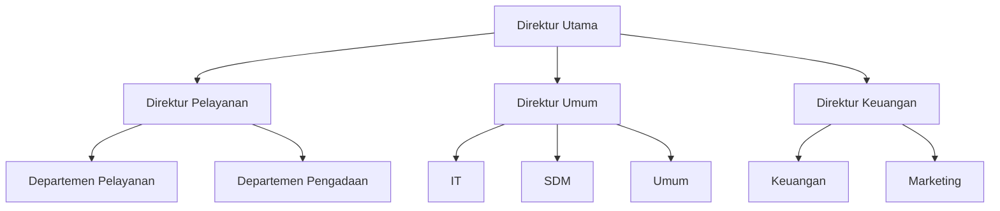
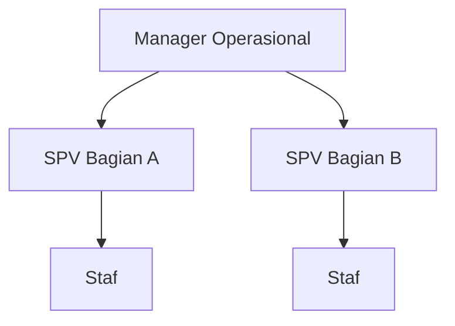

# Rancangan Organisasi dan Persetujuan Berjenjang

Dokumen ini menjadi acuan utama untuk pengembangan struktur organisasi dan penentuan alur persetujuan cuti PT Medika Antapani. Tabel unit bisnis, jabatan, penugasan jabatan, peran jamak, model, seeder, dan middleware peran dasar **sudah tersedia**. Pengelolaan data melalui antarmuka dan pembentukan rute persetujuan masih direncanakan.

## Tujuan Rancangan

- Mewakili unit bisnis, departemen atau bagian, dan hierarki jabatan secara jelas.
- Mendukung satu pegawai yang memegang lebih dari satu jabatan pada waktu yang sama.
- Menentukan alur persetujuan yang berbeda antara Head Office dan unit operasional.
- Mendukung lebih dari satu Manager Operasional tanpa membuat tujuan persetujuan menjadi ambigu.
- Mencegah seseorang memutus pengajuan cutinya sendiri atau menjalankan dua tahap pada pengajuan yang sama.
- Menjaga riwayat persetujuan tetap benar ketika susunan organisasi berubah.

## Istilah

| Istilah | Arti |
| --- | --- |
| Unit bisnis | Lingkup organisasi utama tempat jabatan berada, misalnya HO, KUMA, atau Medlab. |
| Departemen atau bagian | Kelompok kerja di dalam sebuah unit bisnis. Nama akhirnya mengikuti data resmi perusahaan. |
| Jabatan | Posisi dalam struktur organisasi, misalnya Direktur, Kepala Departemen, MO, SPV, atau Staf. |
| Penugasan jabatan | Hubungan antara seorang pegawai dan jabatan yang dipegangnya pada periode tertentu. |
| Penugasan utama | Satu penugasan aktif yang dipakai untuk menentukan alur cuti pegawai. |
| Atasan langsung | Pemegang jabatan induk dari jabatan utama pemohon. |
| Manager Operasional (MO) | Jabatan pengelola operasional pada unit selain HO dan penyetuju tahap MO. |
| Admin HR | Hak akses sistem untuk mengelola data dan memberikan keputusan akhir, bukan nama jabatan organisasi. |

## Unit Bisnis

| Kode | Nama | Kategori |
| --- | --- | --- |
| `HO` | Head Office | Head Office |
| `KUMA` | Klinik Utama Medika Antapani | Unit operasional |
| `KPMA` | Klinik Pratama Medika Antapani | Unit operasional |
| `APOTEK` | Apotek Medika Antapani | Unit operasional |
| `PMB` | Praktek Mandiri Bidan | Unit operasional |
| `MEDLAB` | Medika Laboratorium | Unit operasional |

Daftar departemen atau bagian pada masing-masing unit belum dianggap lengkap sebelum dikonfirmasi menggunakan struktur resmi perusahaan.

## Struktur Head Office

Struktur awal HO yang telah dijelaskan adalah:



Setiap departemen atau bagian dapat memiliki Kepala Departemen, SPV, dan Staf sesuai kondisi sebenarnya. Diagram ini menunjukkan garis organisasi, bukan berarti setiap kotak pasti diisi oleh orang yang berbeda.

## Struktur Umum Unit Operasional



Satu unit dapat mempunyai lebih dari satu MO. Karena itu, setiap jabatan bawahan harus diarahkan ke jabatan MO yang bertanggung jawab atau ke cakupan persetujuan yang ditetapkan Admin HR. Sistem tidak boleh memilih MO secara acak.

## Pegawai dengan Beberapa Jabatan

- Satu pegawai dapat memiliki beberapa penugasan jabatan aktif.
- Setiap penugasan menyimpan jabatan, unit bisnis, masa berlaku, dan status aktif.
- Tepat satu penugasan aktif ditandai sebagai **penugasan utama untuk cuti**.
- Penugasan utama menentukan unit, atasan langsung, dan rute persetujuan pengajuan pribadi.
- Pergantian penugasan utama hanya memengaruhi pengajuan yang dikirim setelah perubahan.
- Jabatan rangkap tidak otomatis memberi hak Admin HR; hak tersebut diberikan terpisah.

Contoh: satu pegawai dapat tercatat sebagai Direktur Utama, Direktur Keuangan, dan Kepala Departemen Marketing. Saat mengajukan cuti, sistem menggunakan penugasan yang ditandai utama, bukan menebak salah satu jabatan.

## Peran Sistem dan Jabatan Organisasi

Peran sistem tetap terdiri dari Karyawan, Atasan, dan Admin HR, tetapi satu akun dapat memiliki lebih dari satu peran.

| Konsep | Ketentuan |
| --- | --- |
| Karyawan | Dimiliki setiap akun pegawai aktif untuk pengajuan pribadi. |
| Atasan | Diperoleh dari penugasan pada jabatan yang mempunyai bawahan atau kewenangan persetujuan. |
| Admin HR | Diberikan secara khusus kepada akun yang menjalankan administrasi HR. |
| MO | Merupakan kategori jabatan dan tahap persetujuan, bukan peran login terpisah. |

Dengan pemisahan ini, pegawai HR dapat masuk sebagai Karyawan untuk mengajukan cuti dan menggunakan fungsi Admin HR untuk pekerjaan HR, tanpa kehilangan salah satu fungsi.

## Aturan Penentuan Rute Persetujuan

Ketika draf dikirim, sistem menjalankan urutan berikut:

1. Mengambil penugasan utama pemohon yang masih aktif.
2. Menentukan unit bisnis dan atasan langsung dari hierarki jabatan.
3. Menyusun seluruh tahap persetujuan yang harus dilalui.
4. Memastikan setiap tahap memiliki penyetuju yang aktif, bukan pemohon, dan tidak menduplikasi orang yang sama.
5. Menyimpan salinan rute tersebut pada pengajuan sebelum status berubah dari `draf`.
6. Menolak pengiriman dengan pesan yang jelas jika struktur atau penyetuju belum lengkap.

Rute yang sudah disimpan tidak berubah otomatis ketika pegawai berpindah jabatan. Perubahan penyetuju terhadap pengajuan aktif harus dilakukan melalui mekanisme pengalihan yang tercatat; mekanisme ini direncanakan untuk tahap lanjutan.

## Alur Persetujuan

### Head Office

Alur normal HO terdiri dari dua tahap:

```text
Atasan langsung -> Admin HR
```

Jika jabatan telah diberi pengecualian resmi `langsung ke HR`, tahap Atasan tidak dibuat dan pengajuan masuk langsung ke Admin HR. Pengecualian ini harus dikonfigurasi secara eksplisit, bukan disimpulkan hanya karena data Atasan kosong.

### Unit Operasional

Alur normal unit selain HO terdiri dari tiga tahap:

```text
Atasan langsung -> Manager Operasional -> Admin HR
```

Jika Atasan langsung pemohon sudah menjabat sebagai MO yang berwenang untuk unit tersebut, tahap Atasan dan tahap MO dipenuhi oleh satu keputusan sehingga alurnya menjadi:

```text
Manager Operasional sebagai Atasan langsung -> Admin HR
```

Sistem tidak membuat dua keputusan berurutan untuk orang yang sama.

### Contoh Rute

| Kondisi pemohon | Rute |
| --- | --- |
| Staf HO di bawah SPV | SPV -> Admin HR |
| Staf unit operasional di bawah SPV | SPV -> MO yang ditetapkan -> Admin HR |
| Pegawai unit operasional yang langsung di bawah MO | MO -> Admin HR |
| Jabatan dengan pengecualian resmi langsung ke HR | Admin HR |
| Pegawai HR yang bukan atasan | Atasan langsung -> Admin HR lain |
| Admin HR yang juga Atasan atau MO | Mengikuti rute penugasan utama; setiap keputusan harus diberikan orang lain yang berwenang |

## Status Pengajuan yang Direncanakan

| Status | Makna |
| --- | --- |
| `draf` | Belum dikirim. |
| `menunggu_atasan` | Menunggu keputusan Atasan langsung. |
| `menunggu_mo` | Tahap Atasan selesai dan menunggu MO. |
| `menunggu_hr` | Seluruh tahap organisasi selesai dan menunggu keputusan akhir Admin HR. |
| `disetujui` | Disetujui Admin HR dan saldo telah diperbarui. |
| `ditolak` | Ditolak pada salah satu tahap. |
| `dibatalkan` | Dibatalkan sesuai aturan. |

Status pertama setelah pengiriman mengikuti tahap pertama pada rute yang dibekukan. Artinya, pengajuan tertentu dapat langsung menjadi `menunggu_hr` jika mempunyai pengecualian resmi.

## Konflik Kepentingan

- Pemohon tidak boleh memberikan keputusan pada pengajuannya sendiri dalam peran apa pun.
- Satu orang tidak boleh memberikan keputusan pada lebih dari satu tahap dalam pengajuan yang sama.
- Pengajuan milik Admin HR harus diputus pada tahap akhir oleh Admin HR lain.
- Jika hanya ada satu Admin HR yang aktif dan ia adalah pemohon, pengajuan tidak dapat diselesaikan sampai tersedia Admin HR lain yang berwenang.
- Admin HR tidak boleh menggunakan hak administrasi untuk melewati tahap organisasi yang tersimpan.
- Semua penolakan, persetujuan, dan pengalihan penyetuju harus memiliki aktor serta waktu yang dapat diaudit.

## Dampak pada Rancangan Database

Rancangan target menambahkan atau menyesuaikan data berikut:

| Tabel | Fungsi yang direncanakan |
| --- | --- |
| `unit_bisnis` | Menyimpan enam unit bisnis dan kategorinya. |
| `departemen` | Menyimpan departemen atau bagian di dalam unit bisnis. |
| `jabatan` | Menyimpan posisi, kategorinya, dan hubungan ke jabatan Atasan. |
| `penugasan_jabatan` | Menghubungkan pegawai dengan satu atau beberapa jabatan serta menandai penugasan utama. |
| `peran` | Menyimpan daftar peran sistem. |
| `pengguna_peran` | Memungkinkan satu akun memiliki beberapa peran. |
| `pengajuan_cuti` | Menyimpan acuan penugasan utama dan konteks organisasi saat dikirim. |
| `persetujuan_cuti` | Menyimpan urutan tahap yang dibekukan, target penyetuju, status tahap, keputusan, dan pemberi keputusan. |

Pada rancangan target, `pegawai.atasan_id`, `pegawai.departemen_id`, kolom teks `pegawai.jabatan`, dan satu nilai `pengguna.peran` tidak lagi menjadi sumber utama struktur organisasi. Kolom tersebut masih dipertahankan sementara untuk kompatibilitas dan akan dipensiunkan setelah seluruh modul berpindah ke struktur baru.

## Aturan Data Penting

- Satu jabatan berada pada satu unit bisnis dan dapat dikaitkan dengan satu departemen atau bagian.
- Satu jabatan dapat mempunyai satu jabatan induk; hubungan melingkar dan hubungan ke dirinya sendiri ditolak.
- Satu pegawai boleh mempunyai banyak penugasan aktif, tetapi hanya satu yang menjadi penugasan utama untuk cuti.
- Satu posisi dapat diisi lebih dari satu pegawai jika memang ditetapkan demikian, misalnya MO.
- Jika terdapat beberapa calon penyetuju pada posisi yang sama, cakupan tanggung jawab harus ditentukan secara eksplisit.
- Data organisasi yang sudah dipakai dalam riwayat tidak dihapus permanen; gunakan penonaktifan dan masa berlaku.

## Hal yang Perlu Dikonfirmasi

Sebelum migration baru dibuat, tim perlu memperoleh keputusan perusahaan tentang:

1. Daftar resmi departemen atau bagian pada setiap unit bisnis.
2. Daftar jabatan dan hubungan Atasan untuk setiap bagian.
3. Pembagian cakupan ketika satu unit memiliki lebih dari satu MO.
4. Penugasan utama untuk pegawai yang merangkap beberapa jabatan.
5. Jabatan mana saja yang secara resmi boleh langsung menuju Admin HR.
6. Penyetuju cuti Direktur Utama.
7. Admin HR pengganti ketika pemohon adalah satu-satunya Admin HR aktif.

## Tahap Implementasi yang Disarankan

1. Validasi struktur organisasi dan pertanyaan terbuka bersama pihak perusahaan.
2. Perbarui rancangan database final dan siapkan strategi migrasi dari fondasi saat ini.
3. Bangun master unit bisnis, departemen, jabatan, penugasan, dan peran jamak.
4. Bangun pembentuk rute persetujuan beserta snapshot tahap.
5. Terapkan otorisasi Atasan, MO, dan Admin HR serta pencegahan konflik kepentingan.
6. Tambahkan antarmuka pengelolaan organisasi dan antrean persetujuan.
7. Uji semua variasi rute sebelum membangun fitur PWA lanjutan.
